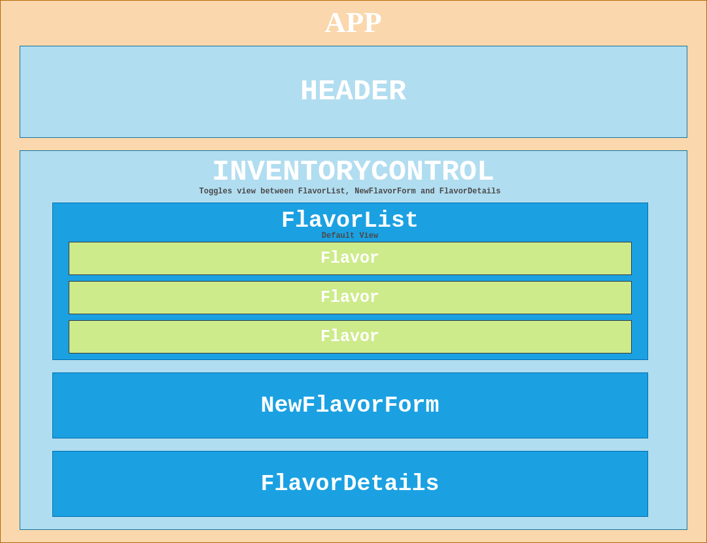

# [Boba Shop](https://github.com/ayohana/boba-shop-react.git)

#### React Fundamentals Exercise for [Epicodus](https://www.epicodus.com/), 04.24.2020

#### By **Adela Darmansyah**

[About](#About) | [User Stories](#User-Stories) | [Component Diagram](##React-Component-Diagram) | [Screenshots](#Screenshots) | [Installation](#Installation-Instructions) | [Bugs](#Known-Bugs) | [Technologies](#Technologies-Used) | [Contact](#Support-and-Contact-Details)

   

## About

**This is a web application for a boba shop manager to keep track of their supplies of flavor powder.** The manager/user will be able to enter a new supply of flavor powder. The manager will also be able to keep track of the remaining number of servings left for each flavor.

## User Stories

* As the manager, I want to see a list of all available flavor powders. For each flavor, I want to see its flavor, type of flavor, brand, price, weight of purchase and remaining number of servings.
* As the manager, I want to submit a form to add a new supply of flavor powder to a list.
* As the manager, I want to be able to click on a flavor to see its detail page.
* As the manager, I want to see how many servings are left in each flavor. Based on our usage overall, 1 kg (2.2 lbs) of powder is enough to make 50 servings.
* As the manager, I want to be able to click a button next to a flavor whenever I sell a serving of it. This should decrease the number of servings left by 1. 
* As the developer, I want to make sure the remaining number of servings should not be able to go below 0.
* As the developer, I want the application to automatically generate the number of servings based on new supply's weight input.

## React Component Diagram

  

## Screenshots

<!--  -->

## Installation Instructions

* Clone this [repository](https://github.com/ayohana/boba-shop-react.git)

* Open the `Command Line Interface` and enter the following:
  * `cd boba-shop-react` to navigate into the repository.
  * `npm install` to install all necessary plug-ins.
  * `npm start` to start the application.

## Known Bugs

No known bugs at this time.

## Technologies Used

* HTML
* CSS
* JavaScript
* React
* Draw.io
* Markdown
* _npm*_

_*Check out `package.json` file to see the complete list of all plug-ins._

## Support and Contact Details

Feel free to provide feedback via email: adela.yohana@gmail.com.

### License

This application is licensed under the MIT license.

Copyright (c) 2020 **Adela Darmansyah**
